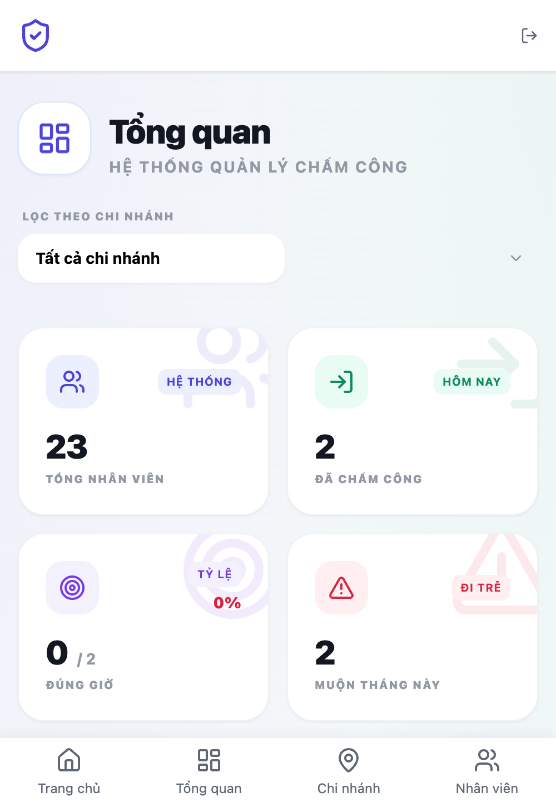
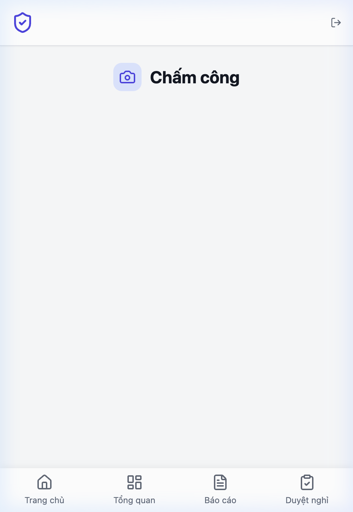
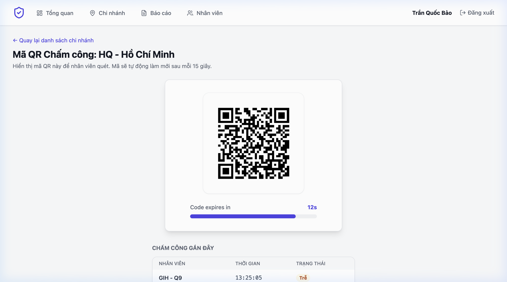
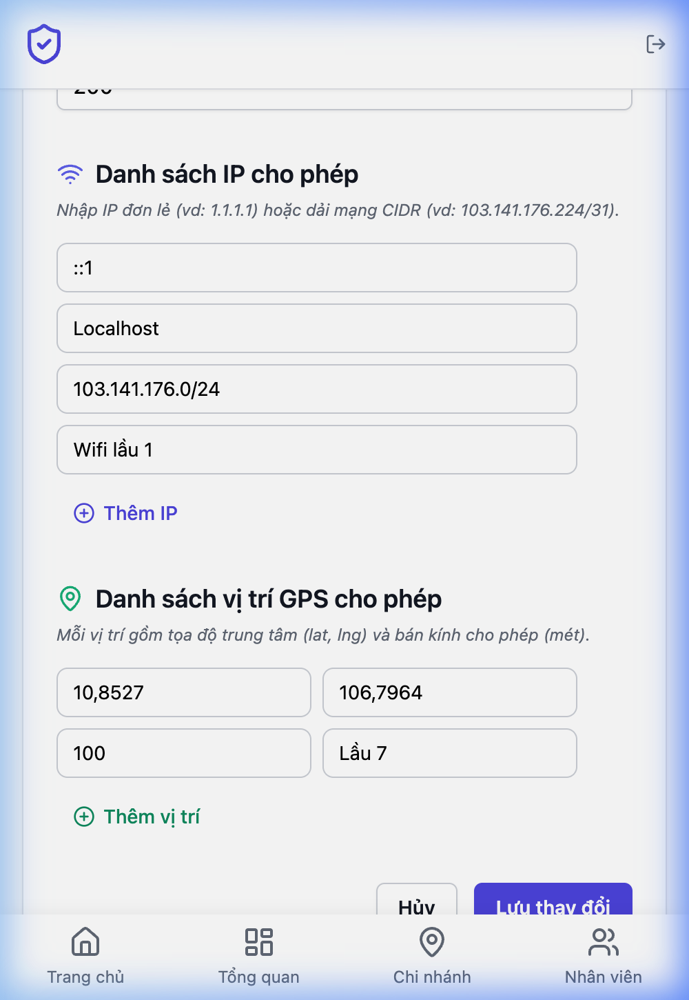
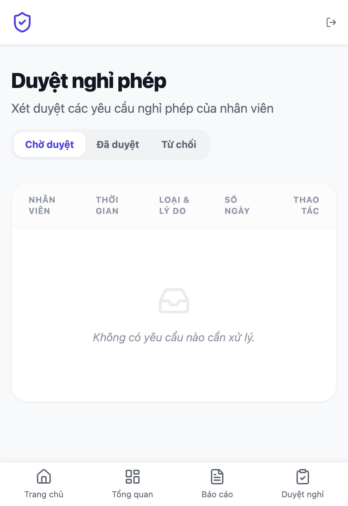
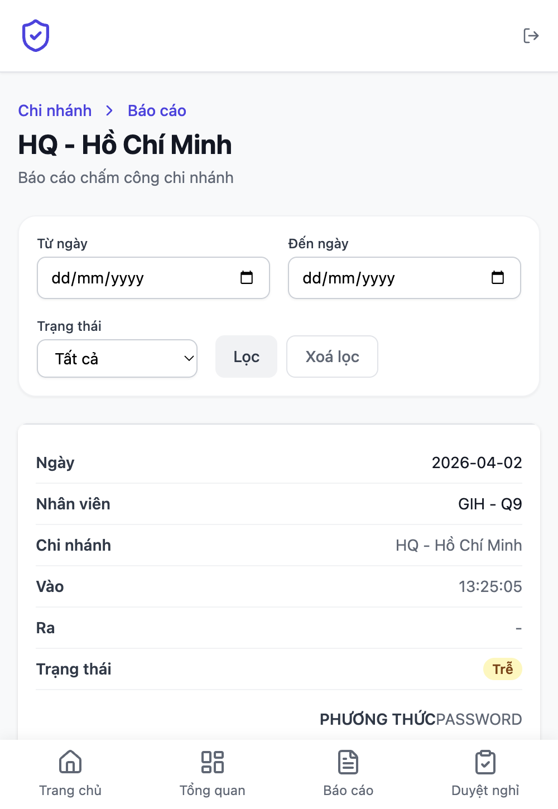
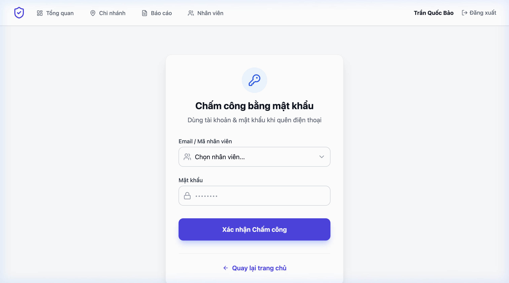
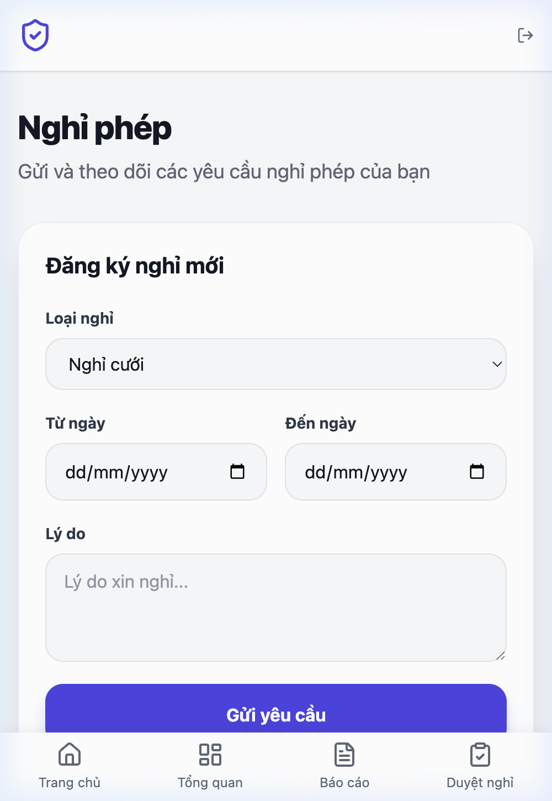
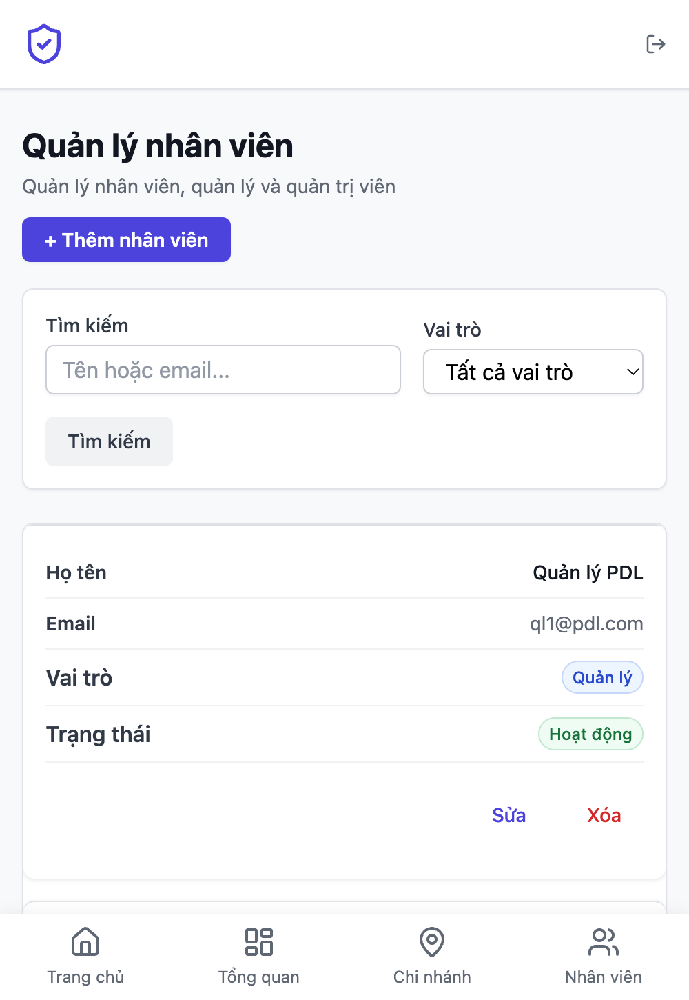

# Smart Attendance — Chấm Công Thông Minh

Hệ thống chấm công thông minh cho doanh nghiệp quy mô **100 chi nhánh**, **5.000 nhân viên**.
Xác thực đa phương thức: QR/TOTP, IP Whitelist, GPS Geofencing, WebAuthn Biometric, Password Kiosk.
Hệ thống chống gian lận 9 lớp (fake GPS, VPN, chấm hộ, clone device).

**Kiến trúc Microservices**: 5 Go services + API Gateway + Next.js frontend (7 containers).

## Tech Stack

| Layer | Technology |
|---|---|
| Backend | **5 Go Microservices** (Chi router, GORM) |
| API Gateway | Go reverse proxy (JWT validation, rate limit, routing) |
| Frontend | **Next.js** (App Router, SSR) + React + TypeScript + Tailwind CSS |
| Database | **PostgreSQL 16** (1 instance, schema-per-service isolation) |
| Cache | go-cache (in-memory, TTL 5 min) |
| Auth | JWT + Refresh Token + WebAuthn (Passkeys) + Microsoft OAuth2 |
| Anti-Fraud | 9-layer detection (GPS accuracy, TOTP nonce, impossible travel, device fingerprint, anomaly detection...) |
| Deploy | Docker Compose — 8 containers (1 PG + 5 Go + 1 Gateway + 1 Next.js) |

## Quick Start

### Run locally

```bash
git clone <repo-url> && cd smart_attendance
cp .env.example .env
go run cmd/server/main.go
# Open http://localhost:8080
```

### Run with Docker

```bash
cp .env.example .env
docker-compose up --build
```

### Seed large dataset (100 branches + 5000 users)

```bash
go run cmd/seed/main.go
```

---

## Screenshots

| Dashboard (Admin/Manager) | Chấm công QR (Employee) | Mã QR chi nhánh (Kiosk) |
|:---:|:---:|:---:|
|  |  |  |

| Quản lý chi nhánh (Admin) | Duyệt nghỉ phép (Manager) | Báo cáo + Export Excel |
|:---:|:---:|:---:|
|  |  |  |

| Chấm công mật khẩu (Kiosk) | Nghỉ phép (Employee) | Quản lý nhân viên (Admin) |
|:---:|:---:|:---:|
|  |  |  |

> Chụp screenshots và lưu vào `docs/screenshots/` với tên file tương ứng.

---

## Demo Accounts

Hệ thống seed sẵn 22 users (1 admin, 3 managers, 3 kiosk devices, 15 employees) trên 3 chi nhánh.

| Role | Email | Password | Mô tả |
|------|-------|----------|-------|
| **Admin** | `admin@smartattendance.com` | `password123` | Quản trị toàn hệ thống |
| **Quản lý (HCM)** | `manager.hcm@demo.com` | `password123` | Quản lý chi nhánh HCM |
| **Quản lý (HN)** | `manager.hn@demo.com` | `password123` | Quản lý chi nhánh Hà Nội |
| **Quản lý (ĐN)** | `manager.dn@demo.com` | `password123` | Quản lý chi nhánh Đà Nẵng |
| **Kiosk HCM** | `device.hcm@demo.com` | `password123` | Manager Máy — hiển thị QR, chấm công mật khẩu |
| **Kiosk HN** | `device.hn@demo.com` | `password123` | Manager Máy — hiển thị QR, chấm công mật khẩu |
| **Nhân viên** | `emp1.hcm@demo.com` | `password123` | Nhân viên chi nhánh HCM |

---

## Hướng Dẫn Demo Từng Chức Năng

### 1. Admin — Quản trị hệ thống

> Login: `admin@smartattendance.com` / `password123`

| Chức năng | Cách truy cập | Mô tả |
|---|---|---|
| **Dashboard** | Trang chủ > "Tổng quan" | Xem KPI: tổng NV, check-in hôm nay, tỷ lệ đúng giờ, top trễ |
| **Quản lý chi nhánh** | Nav > "Chi nhánh" | Tạo/sửa/xóa chi nhánh, cấu hình phương thức chấm công |
| **Cấu hình IP/GPS** | Chi nhánh > Sửa | Thêm/xóa IP whitelist (CIDR), vị trí GPS (lat, lng, radius) |
| **Quản lý nhân viên** | Nav > "Nhân viên" | Tạo user, gán role (Employee/Manager/Manager Máy), gán chi nhánh |
| **Xem báo cáo** | Nav > "Báo cáo" > Chọn chi nhánh | Xem chấm công theo ngày, filter trạng thái, export Excel |

**Demo thử:**
1. Vào "Chi nhánh" > Sửa 1 chi nhánh > Bật/tắt phương thức chấm công (QR, WiFi+GPS, FaceID, Password)
2. Vào "Nhân viên" > Tạo mới > Chọn role "Manager Máy" > Gán chi nhánh
3. Vào "Báo cáo" > Chọn chi nhánh > Xem danh sách > "Xuất Excel"

### 2. Quản lý (Manager) — Giám sát chi nhánh

> Login: `manager.hcm@demo.com` / `password123`

| Chức năng | Cách truy cập | Mô tả |
|---|---|---|
| **Dashboard** | Trang chủ > "Tổng quan" | Xem thống kê chi nhánh mình |
| **Báo cáo chi nhánh** | Nav > "Báo cáo" | Xem chấm công NV, filter ngày/trạng thái, export Excel |
| **Duyệt nghỉ phép** | Nav > "Duyệt nghỉ" | Xem đơn pending, Approve/Reject với ghi chú |

**Demo thử:**
1. Vào "Báo cáo" > Xem danh sách chấm công > Filter "Trễ" > "Xuất Excel"
2. Vào "Duyệt nghỉ" > Tab "Chờ duyệt" > Nhấn nút Approve (tick xanh) hoặc Reject (X đỏ)

### 3. Manager Máy (Kiosk Device) — Thiết bị chấm công

> Login: `device.hcm@demo.com` / `password123`

| Chức năng | Cách truy cập | Mô tả |
|---|---|---|
| **Hiển thị mã QR** | Nav > "Mã QR" | QR code auto-refresh mỗi 15 giây, đặt màn hình tại chi nhánh |
| **Chấm công mật khẩu** | Nav > "Chấm công mật khẩu" | Chọn NV từ dropdown, nhập mật khẩu, chấm công |
| **Chấm công FaceID** | Nav > "FaceID" *(nếu admin bật)* | Mở camera nhận diện khuôn mặt (demo giả lập) |

**Demo thử:**
1. Vào "Mã QR" > Thấy QR code + countdown timer 15s + danh sách check-in gần đây
2. Vào "Chấm công mật khẩu" > Chọn nhân viên > Nhập `password123` > "Xác nhận Chấm công"
3. Thấy thông báo "Chấm công thành công!" > Nhấn "Xong" về trang chủ

### 4. Nhân viên (Employee) — Chấm công hàng ngày

> Login: `emp1.hcm@demo.com` / `password123`

| Chức năng | Cách truy cập | Mô tả |
|---|---|---|
| **Quét QR chấm công** | Nav > "Chấm công" | Mở camera > Quét mã QR tại chi nhánh > Tự động gửi |
| **Chấm công WiFi+GPS** | Trang chủ > "Chấm công WiFi+GPS" | Tự lấy IP + GPS > Xác thực vị trí |
| **Xem lịch sử** | Nav > "Lịch sử" | Xem chấm công cá nhân, filter ngày/trạng thái |
| **Đăng ký nghỉ phép** | Nav > "Nghỉ phép" | Chọn loại phép, ngày, lý do > Gửi đơn > Chờ duyệt |
| **Hồ sơ cá nhân** | Nav > "Hồ sơ" | Xem thông tin, đăng ký WebAuthn/Passkey |

**Demo thử:**
1. Vào "Nghỉ phép" > Chọn "Nghỉ phép năm" > Ngày mai > Lý do "Việc gia đình" > "Gửi yêu cầu"
2. Đăng nhập `manager.hcm@demo.com` > "Duyệt nghỉ" > Approve đơn vừa tạo
3. Quay lại `emp1.hcm@demo.com` > "Lịch sử" > Thấy ngày nghỉ status "Nghỉ phép"

### 5. Hệ thống chống gian lận (Anti-Fraud) — 9 lớp bảo vệ

Hệ thống tự động phát hiện và cảnh báo các hành vi gian lận qua 9 lớp kiểm tra độc lập. Mỗi lớp chạy song song khi nhân viên check-in, kết quả ghi vào bảng `fraud_alerts` để admin review.

| Lớp | Cơ chế | Hành vi chặn |
|---|---|---|
| 1 | GPS Accuracy Check | Reject GPS accuracy < 10m (fake GPS) hoặc > 150m |
| 2 | TOTP Single-Use | Mỗi mã QR chỉ dùng 1 lần trong 30s — chặn chụp ảnh chia sẻ |
| 3 | Rate Limit / User | Max 3 check-in / 5 phút / user |
| 4 | Impossible Travel | Di chuyển > 150km/h giữa 2 lần check-in |
| 5 | Device Fingerprint | Bind thiết bị với user, alert khi device lạ |
| 6 | IP-Location Cross | So sánh IP vs GPS > 500km — phát hiện VPN |
| 7 | WebAuthn Sign Count | Detect authenticator bị clone |
| 8 | Anomaly Detection | Z-score > 3.0 trên pattern check-in 30 ngày |
| 9 | Concurrent Session | Max 3 session/user, auto-revoke oldest |

#### Chi tiết từng lớp

**Lớp 1 — GPS Accuracy Check (Chống fake GPS)**

Ứng dụng fake GPS thường trả về tọa độ chính xác tuyệt đối (accuracy ≈ 0m), trong khi GPS thật luôn có sai số 10–150m. Hệ thống reject nếu:
- `accuracy < 10m` → nghi ngờ fake GPS (quá chính xác)
- `accuracy > 150m` → tín hiệu yếu, không đáng tin cậy

```
📱 Fake GPS app:  accuracy = 0.5m  → ❌ Rejected (< 10m)
📱 GPS thật:      accuracy = 25m   → ✅ Accepted
📱 Trong hầm:     accuracy = 200m  → ❌ Rejected (> 150m)
```

**Lớp 2 — TOTP Single-Use Nonce (Chống chụp ảnh/chia sẻ QR)**

Mã QR tại chi nhánh chứa TOTP code (Time-based One-Time Password) reset mỗi 15 giây. Mỗi code chỉ được dùng **đúng 1 lần** (nonce), lưu vào cache để chặn reuse:

```
15:00:00  QR hiển thị code "A1B2C3"
15:00:05  NV Hùng quét → ✅ check-in thành công, code "A1B2C3" đánh dấu đã dùng
15:00:08  NV Lan quét cùng code → ❌ Rejected (code đã sử dụng — nghi chụp ảnh chia sẻ)
15:00:15  QR reset → code mới "D4E5F6"
```

**Lớp 3 — Rate Limit per User (Chống spam check-in)**

Giới hạn tối đa **3 lần check-in trong 5 phút** cho mỗi user (tách biệt với rate limit IP). Ngăn chặn brute-force quét QR hoặc spam request:

```
15:00:00  Check-in lần 1 → ✅
15:01:00  Check-in lần 2 → ✅
15:02:00  Check-in lần 3 → ✅
15:03:00  Check-in lần 4 → ❌ Rate limited (chờ hết 5 phút)
```

**Lớp 4 — Impossible Travel Detection (Chống chấm hộ từ xa)**

So sánh tọa độ GPS giữa 2 lần check-in liên tiếp, tính vận tốc di chuyển bằng công thức Haversine. Nếu vận tốc > **150 km/h** → không thể di chuyển hợp lý:

```
09:00  Check-in tại HCM (10.776, 106.700)
09:15  Check-in tại Hà Nội (21.028, 105.854)  ← khoảng cách ~1,200km
       Vận tốc = 1200km / 0.25h = 4,800 km/h → ❌ Impossible travel!
```

**Lớp 5 — Device Fingerprinting (Chống mượn thiết bị)**

Thu thập fingerprint thiết bị (User-Agent, screen resolution, platform... → SHA-256 hash) và bind với user. Khi phát hiện thiết bị mới chưa từng dùng:

```
NV Hùng luôn dùng iPhone 15 (hash: abc123)
Đột nhiên check-in từ Samsung S24 (hash: xyz789) → ⚠️ FraudAlert: thiết bị lạ
```

Admin nhận cảnh báo để xác minh — có thể là thiết bị mới hợp lệ hoặc ai đó mượn tài khoản.

**Lớp 6 — IP-Location Cross-Check (Chống VPN/Proxy)**

So sánh vị trí địa lý của IP address (tra cứu GeoIP) với tọa độ GPS gửi lên. Nếu khoảng cách > **500km** → nghi ngờ dùng VPN:

```
IP: 113.161.x.x → GeoIP: Hồ Chí Minh
GPS gửi lên:    → Hồ Chí Minh         → ✅ Khớp

IP: 185.220.x.x → GeoIP: Đức (VPN)
GPS gửi lên:    → Hồ Chí Minh         → ⚠️ Lệch 9,000km — nghi VPN
```

**Lớp 7 — WebAuthn Sign Count (Chống clone authenticator)**

WebAuthn (FaceID/TouchID/Windows Hello) sử dụng **sign count** — bộ đếm tăng dần mỗi lần xác thực. Nếu ai đó clone authenticator, 2 thiết bị sẽ có sign count riêng → server phát hiện count không tăng monotonically:

```
Lần 1: sign_count = 1  → ✅
Lần 2: sign_count = 2  → ✅
Lần 3: sign_count = 2  → ❌ Clone detected! (count phải là 3 nhưng vẫn là 2)
```

Cơ chế WebAuthn đảm bảo **private key không bao giờ rời thiết bị** — server chỉ lưu public key và verify signature. Ngay cả khi server bị hack, attacker không thể giả mạo xác thực.

**Lớp 8 — Anomaly Detection (Phát hiện bất thường thống kê)**

Tính **Z-score** trên thời gian check-in 30 ngày gần nhất. Nếu thời gian hôm nay lệch > **3.0 standard deviation** so với pattern thông thường → flag bất thường:

```
Pattern 30 ngày: check-in trung bình 08:02, std dev = 5 phút
Hôm nay check-in: 05:30 → Z-score = (05:30 - 08:02) / 5min = -30.4 → ⚠️ Bất thường!
```

Phát hiện các trường hợp: bot tự động check-in lúc nửa đêm, ai đó dùng tài khoản người khác với pattern khác hẳn.

**Lớp 9 — Concurrent Session Limit (Chống chia sẻ tài khoản)**

Giới hạn tối đa **3 session đồng thời** cho mỗi user. Nếu đăng nhập thiết bị thứ 4 → tự động revoke session cũ nhất:

```
Session 1: iPhone (HCM)     → active
Session 2: Laptop (HCM)     → active
Session 3: iPad (HCM)       → active
Session 4: Android (Hà Nội) → ✅ active, nhưng Session 1 bị revoke
```

Ngăn chặn việc chia sẻ tài khoản cho nhiều người để chấm hộ.

---

## Hệ thống phân quyền (4 Roles)

| Role | Tên | Quyền |
|---|---|---|
| **admin** | Quản trị viên | Toàn quyền: quản lý chi nhánh, nhân viên, báo cáo, dashboard |
| **manager** | Quản lý | Xem dashboard + báo cáo chi nhánh, duyệt nghỉ phép, export Excel |
| **manager_device** | Manager Máy | Hiển thị QR, chấm công bằng mật khẩu/FaceID (dùng cho kiosk) |
| **employee** | Nhân viên | Chấm công (QR/GPS/WiFi), xem lịch sử, đăng ký nghỉ phép |

---

## Database Schema

Hệ thống sử dụng **22 tables** trên PostgreSQL (schema-per-service), chia thành 5 schemas:

```
 CORE (3)                    BRANCH CONFIG (3)              ATTENDANCE (4)
┌──────────┐                ┌──────────────────┐           ┌──────────────────┐
│ branches │──┐             │ branch_ip_       │           │   attendances    │
│ users    │  ├──► 1:N ───► │   whitelists     │           │ (1 rec/user/day) │
│departments│  │             │ branch_locations │           │   attendance_    │
└──────────┘  │             │ work_shifts      │           │     logs         │
              │             └──────────────────┘           │ (N scans/day)    │
              │                                            │ attendance_adj.  │
              │  LEAVE (5)           SECURITY (6)          │ user_shift_asgn. │
              │ ┌──────────────┐    ┌──────────────────┐   └──────────────────┘
              ├►│ leave_types  │    │ user_credentials │
              │ │ leave_requests│   │ user_devices     │   RBAC (2)
              │ │ leave_balances│   │ user_sessions    │   ┌──────────────────┐
              │ │ overtime_req.│    │ fraud_alerts     │   │ permissions      │
              │ │ holidays     │    └──────────────────┘   │ role_permissions │
              │ └──────────────┘                           └──────────────────┘
              │
              │  GAMIFICATION (2)
              └►┌──────────────┐
                │ user_streaks │
                │ user_badges  │
                └──────────────┘
```

> Chi tiết ERD, mô tả từng table, indexes: **[docs/DATABASE.md](docs/DATABASE.md)**

---

## Architecture — Microservices

```
┌─────────────────────────────────────────────────────────┐
│              Next.js Frontend (port 3000)                │
│         SSR + React + TypeScript + Tailwind CSS          │
└─────────────────────────┬───────────────────────────────┘
                          │ HTTP / JSON
┌─────────────────────────▼───────────────────────────────┐
│                 API Gateway (port 8080)                   │
│           Go + Chi │ JWT validate │ Rate limit            │
│              CORS │ Route │ Aggregate                     │
└──────┬────────┬────────┬────────┬────────┬──────────────┘
       │        │        │        │        │
       ▼        ▼        ▼        ▼        ▼
┌─────────┐┌────────┐┌───────┐┌─────────┐┌────────────┐
│  Auth   ││Attend. ││ Leave ││Analytics││Organization│
│  8081   ││ 8082   ││ 8083  ││  8084   ││   8085     │
│         ││        ││       ││         ││            │
│• User   ││• Check ││• CRUD ││• Dash-  ││• Branch    │
│• JWT    ││  in/out││• Ap-  ││  board  ││• IP/GPS    │
│• WebAuth││• Anti- ││  prove││• Report ││  config    │
│• RBAC   ││  Fraud ││• Bal- ││• Export ││• Shift     │
│• OAuth  ││• QR/   ││  ance ││  Excel  ││• Dept      │
│• Session││  TOTP  ││       ││         ││• Holiday   │
│         ││• Alert ││       ││         ││            │
│         ││• Adj.  ││       ││         ││            │
└────┬────┘└───┬────┘└──┬────┘└────┬────┘└─────┬──────┘
     └─────────┴────────┴─────────┴────────────┘
                         │
              ┌──────────▼──────────┐
              │  PostgreSQL (5432)  │
              │  5 schemas isolés   │
              └─────────────────────┘
```

1 PostgreSQL instance, mỗi service sở hữu schema riêng. Giao tiếp sync HTTP REST.

> Chi tiết kiến trúc, API contracts, build order: **[docs/MICROSERVICES.md](docs/MICROSERVICES.md)**

## Project Structure

```
smart_attendance/
├── services/                         # 5 Go microservices + Gateway
│   ├── gateway/                      # API Gateway (port 8080)
│   │   ├── cmd/main.go
│   │   └── internal/                 # proxy, middleware, config
│   ├── auth/                         # Auth Service (port 8081)
│   │   ├── cmd/main.go
│   │   └── internal/                 # handler, service, repo, model, db
│   ├── attendance/                   # Attendance Service (port 8082)
│   │   ├── cmd/main.go
│   │   └── internal/                 # + client/ (→ Auth, Org)
│   ├── leave/                        # Leave Service (port 8083)
│   │   ├── cmd/main.go
│   │   └── internal/                 # + client/ (→ Auth, Attendance)
│   ├── analytics/                    # Analytics Service (port 8084)
│   │   ├── cmd/main.go
│   │   └── internal/                 # + client/ (→ all services)
│   └── organization/                 # Organization Service (port 8085)
│       ├── cmd/main.go
│       └── internal/
├── frontend/                         # Next.js Frontend (port 3000)
│   ├── src/
│   │   ├── app/                      # App Router (22 SSR pages)
│   │   ├── components/               # Shared React components
│   │   └── lib/                      # API client, auth, types
│   ├── tailwind.config.ts
│   └── package.json
├── shared/                           # Shared Go packages
│   ├── dto/                          # Inter-service DTOs
│   ├── middleware/                    # Internal auth header parsing
│   └── response/                     # Standard JSON response format
├── cmd/server/main.go                # Legacy monolith (reference)
├── internal/                         # Legacy monolith code (reference)
├── web/templates/                    # Legacy HTMX templates (reference)
├── docs/
│   ├── DATABASE.md                   # ERD + table descriptions
│   └── MICROSERVICES.md              # Microservices architecture plan
├── docker-compose.yml                # 7 containers orchestration
├── CLAUDE.md                         # AI context file
├── TASKS.md                          # Task breakdown
└── PROMPT_LOG.md                     # AI development log
```

## Configuration

| Variable | Default | Description |
|---|---|---|
| `PORT` | 8080 | Server port |
| `ENV` | development | development / production |
| `DB_PATH` | data/smart_attendance.db | SQLite file path |
| `TURSO_URL` | (empty) | Turso remote DB URL (overrides DB_PATH) |
| `TURSO_TOKEN` | (empty) | Turso auth token |
| `JWT_SECRET` | (change me) | JWT signing secret |
| `JWT_EXPIRE_MINUTES` | 60 | Access token TTL |
| `JWT_REFRESH_HOURS` | 168 | Refresh token TTL (7 days) |
| `RATE_LIMIT_PER_MIN` | 10 | IP rate limit per minute |
| `WEBAUTHN_RPID` | localhost | WebAuthn Relying Party ID |
| `WEBAUTHN_ORIGIN` | http://localhost:8080 | WebAuthn origin |

## API Endpoints (via Gateway :8080)

### Public
- `POST /api/auth/login` → Auth Service — Login
- `POST /api/auth/refresh` → Auth Service — Refresh token

### Protected (JWT required, routed by Gateway)
| Path | Service | Mô tả |
|---|---|---|
| `/api/attendance/log` | Attendance | Check-in/out |
| `/api/attendance/status` | Attendance | Today's status |
| `/api/alerts/*` | Attendance | Fraud alerts (manager) |
| `/api/adjustments/*` | Attendance | Bổ sung công |
| `/api/leave/*` | Leave | Nghỉ phép |
| `/api/dashboard/*` | Analytics | Dashboard stats/charts |
| `/api/reports/*` | Analytics | Reports + Excel export |
| `/api/branches/*` | Organization | Branch CRUD + config |
| `/api/users/*` | Auth | User CRUD |
| `/api/webauthn/*` | Auth | WebAuthn registration/login |

### Internal (service-to-service, không qua Gateway)
| Path | Service | Called by |
|---|---|---|
| `/api/internal/validate-token` | Auth | Gateway |
| `/api/internal/branches/:id` | Organization | Attendance |
| `/api/internal/attendance/sync-leave` | Attendance | Leave |
| `/api/internal/users/:id` | Auth | Attendance, Leave |

> Chi tiết API contracts: **[docs/MICROSERVICES.md](docs/MICROSERVICES.md)**

## Scaling Strategy

- **Microservices** — mỗi service scale độc lập (Attendance scale 10x lúc peak)
- **Schema-per-service** — 1 PostgreSQL, mỗi service schema riêng
- **In-memory cache** — branch config, permissions, dashboard stats (5 min TTL)
- **Gateway stateless** — horizontal scale bằng load balancer
- **Composite indexes** — `(user_id, work_date)`, `(branch_id, work_date)`
- **Scale tiếp** — separate PG instances + Redis + Kubernetes + Kafka event bus

## License

MIT
